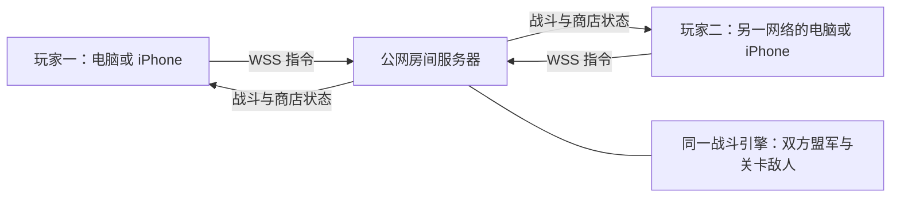

> 这是 0.4 预研记录。0.5 已接入本机双窗口合作界面与服务：创建/加入、各自商店、三关闯关、共同暂停和刷新重连均可操作。使用方法见相邻「种族战役2复刻/双窗口合作测试说明.md」。公网部署、真实 iPhone 验收仍未完成。

# 公网连接与双人合作预研

2026-09-24 · 基于复刻版 0.4.0

## 结论

不在同一局域网也可以方便连接。推荐部署一个公网房间服务器：两人打开同一个 HTTPS 网页，创建/输入房间码，各自用 WSS 主动连接服务器。双方电脑、iPhone 可以处于不同 Wi-Fi 或蜂窝网络，通常不用配置家中路由器端口映射。服务器需要持续在线、有可信 TLS 证书且网络可达；延迟取决于两端网络和服务器位置。

这是推荐架构及可行性判断，**本轮没有部署公网服务**。当前 EXE 仍仅监听本机；合作原型也只监听回环地址。HTTPS 页面使用加密 WebSocket 的依据见 [MDN WebSocket 客户端文档](https://developer.mozilla.org/en-US/docs/Web/API/WebSockets_API/Writing_WebSocket_client_applications)。

连接本身不是主要难点。剩余工作集中在合作 HUD、房间流程、服务器部署、断线恢复及真实手机性能；无需改变目前的八路玩法来实现合作。

## 对旧 iOS 版的确认

找到 2010 年《Warlords: Call to Arms》的历史产品页，开发者介绍明确列出合作/对战、Wi-Fi/Bluetooth、本地商店与升级。这与用户回忆的版本相符，但该页不足以确认具体波次、通关奖励和关后双商店细节。[TouchArcade 历史条目](https://toucharcade.com/games/warlords-call-to-arms)

本轮以用户描述定义合作流程；下面三关是为了验证机制新写的试验关，**不是从旧 iOS 游戏提取的关卡**。

## 已实现的合作原型

1. 两人各选一个种族，分别拥有军队、升级、黄金、出兵充能和路线。两支军队均从左边向右移动，不互相攻击。
2. 右方是第三个控制者，由关卡波次驱动。长间隔后八路同时出兵，可以指定种族、兵种、数值升级和特殊状态。
3. 两名玩家共用防线生命，敌方突破扣生命；撑过所有波次且场上无存活敌人即过关，生命耗尽或超时失败。双方突破不直接触发普通野战的 25 分胜利。
4. 过关后双方各得一份奖励，各自进入商店。双方都点准备才开下一关；购买后会取消该玩家的准备。失败可返回商店重试同关，不重复发奖。
5. 商店逻辑直接共用复刻版 `progression.js`：原价格、适用种族/兵种、升级条件、十种上限、半价售兵和保留升级。合作开始每人 500 黄金，对照原脚本；野战界面的 3000 是试用资金。
6. 服务器按连接分配玩家身份，客户端不能指定替别人买兵或出兵；指令序号去重。主动断开后暂停，30 秒内凭服务器签发令牌恢复原席位。

当前协议验证采用两个真实 WebSocket 客户端。合作商店已经共用数据规则，但**现有商店 UI 尚未连接到合作服务器**；本轮没有可供两名真人点击游玩的合作入口。

## 三个试验关

| 关卡 | 右方 | 波次时间（秒） | 每波八路兵种 | 防线 / 每人奖励 |
|---|---|---|---|---|
| 边境防线 | 北方兽人 | 12、30、48 | 长矛、侦察、剑士 | 20 / 500 |
| 亡灵来袭 | 亡灵 | 10、26、42、58 | 冲刺长矛、剑士、战斗法师、连枷 | 18 / 650 |
| 熔岩之门 | 恶魔 | 10、26、42、58、74 | 举盾剑士、长矛大师、战斗法师、冲刺长矛、长矛大师 | 16 / 800 |

每关时限分别为 180、200、240 秒。波次、敌人强化和奖励均在 `levels.json` 中修改，机制在 `coop-campaign.cjs` 中；后续扩关无需改出兵渲染。

自动测试用现有 AI 分别驱动两个盟军，通过正常战斗连续完成三关，耗时分别 1988、2835、4685 tick（24 tick/秒），最终每人 2450 黄金。另有失败、重试、奖励只发一次、双方准备、保存恢复与重连检查。这证明流程能跑通，不代表关卡难度已适合真人。

## iPhone 与性能

网页方案可行，原画 Canvas 和触控仍沿用当前代码。新版在 390×844 竖屏、844×390 横屏进行浏览器检查，修复缩放舞台在焦点变化时被滚动裁切的问题。施法者只打包已开放法术可到达的动作，减少手机解码负担。单族全部已迁移单位的半尺寸图集约 18.2–22.8 MiB RGBA；实际按出战军队加载，三族合作还需按关卡卸载旧图集。

原型服务器 24 Hz 运行、常规状态 8 Hz 下发。本机样本中每客户端战斗状态约 11.6–14.5 KiB/s，峰值 37–55 个单位；见 `coop-benchmark-results.json`。这些数字不含图片下载、TLS/TCP、重传及操作触发的额外广播，不是公网流量或 iPhone 帧率测量。

iOS 切后台/锁屏时网页可能暂停，不能依赖客户端维持房间计时；后续需服务器心跳、超时与恢复快照。[WebKit 关于后台页面暂停的说明](https://webkit.org/blog/8970/how-web-content-can-affect-power-usage/)

## 接下来实现顺序

1. 做可玩的本机合作界面：两支左方军队各有头像/路线/充能；右边显示敌方波次与共用防线。商店接入服务器购买确认、队友准备状态。
2. 接房间创建/加入、种族选择、网络插值、重连恢复；客户端预加载盟军两族及当关敌族。
3. 部署 HTTPS/WSS 的小规模测试服务，设置实际站点来源、连接心跳、房间限额与关卡存档。当前回环原型不能仅改监听地址就当正式服务。
4. 两部真实设备跨网验收（Wi-Fi 与蜂窝），覆盖 iPhone Safari 横屏、锁屏、断网重连、重复购买和双方不同步准备，再调合作难度。

预研已解决「同侧两种族」「独立充能」「整排敌军」「关后商店」的核心结构。仍未完成前端联网、公网部署、半开连接检测、服务重启后恢复、真实弱网与真机性能验收。

## 文件与复验

- `coop-campaign.cjs`：闯关状态与共享商店。
- `coop-room-server.cjs`：回环合作房间服务，默认 `ws://127.0.0.1:18641`。
- `levels.json`：三关配置；`simulation-results.json`：正常模拟通关结果。
- `coop-tests.cjs`：七组合作与双客户端网络测试。
- `coop-benchmark.cjs` / `coop-benchmark-results.json`：本机原型测量。

保持本目录与「种族战役2复刻」「联机预研」相邻。开发环境中运行 `node coop-tests.cjs`；服务试验运行 `node coop-room-server.cjs`。使用相邻目录已带的 [ws](https://github.com/websockets/ws) 库，无须重新安装。房间协议规则版本 0.4.0。
