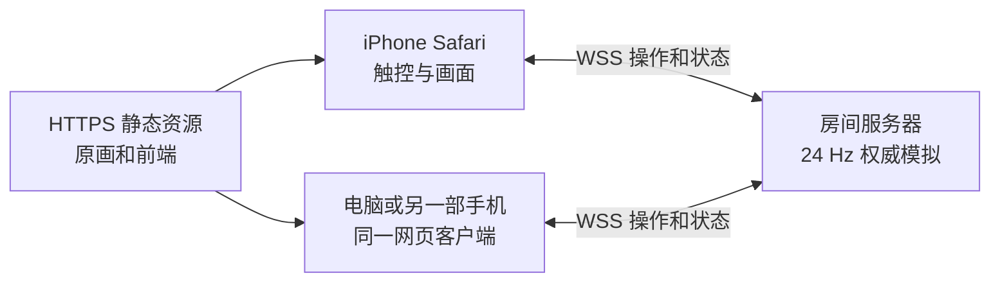

> 本文保留为 0.3 阶段记录，其中基准数据对应当时版本。0.4 合作进展请看相邻「合作模式预研/公网与双人合作预研.md」；本目录服务代码已随 0.4 升级。

# iPhone 网页与远程联机预研

2026-09-24，战斗版 0.3。

**可行性高。现有战斗引擎可直接复用，手机主要补触控、资源管理与网络显示。** 本轮完成手机界面初版和独立的本机联机协议验证，尚未提供可供两部手机连接的公网游戏。

## 当前进度

| 内容 | 状态 |
|---|---|
| 触屏选路、选兵、出兵、自动出兵、暂停 | 已接入游戏，横竖屏已检查 |
| 手机图集与双方按需加载 | 已接入；桌面保留完整分辨率 |
| 点击启用 WebAudio、切后台暂停本地对局 | 已接入，真实 Safari 待验证 |
| 服务端运行同一引擎，24 tick/s | 本机 WebSocket 原型通过 |
| 创建/加入、双方准备、种族选择 | 协议原型通过，尚无联机游戏菜单 |
| 席位隔离、合法兵种、冷却、重复指令去重 | 双客户端测试通过 |
| 断开暂停、令牌重连、恢复席位和序号 | 主动断开连接测试通过 |
| 客户端插值、真实弱网、HTTPS/WSS 公网部署 | 待实现 |
| iPhone Safari 真机验收 | 未进行 |

## 建议架构



服务器决定冷却、攻击、随机数和胜负。客户端发送“选路、选兵、出兵”，服务器每秒发 8 次画面状态，客户端平滑显示位置和动画。8 Hz 是原型起点，需通过真实网络调节；画面插值尚未实现。

第一版适合服务器主持对局。WebKit 会节流后台计时器，iOS 页面可能被完全挂起，所以战斗时钟应保留在服务器，回到前台后重新领取状态。这是基于平台行为作出的架构判断。[WebKit 后台与能耗说明](https://webkit.org/blog/8970/how-web-content-can-affect-power-usage/)

服务端使用 Node.js + WebSocket 可复用当前引擎。原型采用 npm 官方仓库的 `ws` 8.21.3，验证下载 SHA512 并保留许可；正式浏览器客户端用内置 WebSocket。[ws 官方项目](https://github.com/websockets/ws)

正式版用 HTTPS 页面 + WSS，先做“房间码邀请好友”，不需要先引入账号、匹配或排行榜。现有启动器的 `127.0.0.1` 只属于本机；远程朋友和手机需要外部可访问的网页及房间服务。当前没有部署或修改路由器、防火墙。

## iPhone 适配

Safari 已支持 Pointer Events，可统一触控与鼠标输入；平台具备相关能力不等于这个项目已经通过真机验收。[WebKit Safari 13 功能说明](https://webkit.org/blog/9674/new-webkit-features-in-safari-13/)

当前保留原版 7:5 战场，竖屏把大按钮放下方、横屏放右侧。操作按钮高 44 px，出兵按钮高 48 px。原画头像和文字在小屏上仍然较小，因此提供大按钮切换及当前兵种/路线提示。触控初版操作左方，正式联网后需映射到玩家自己的席位。

图集不能一次全部解码。已完成逐帧裁透明、双方按需加载和手机半分辨率图集：单族 RGBA 体积估算 **16.47–18.94 MiB**，两族约 **33–38 MiB**，还要另计背景、Canvas、JS、纹理副本及解码峰值。这是尺寸计算，不是 iPhone 内存实测或兼容上限。

真机应至少覆盖一台较旧和一台较新的 iPhone，检查横竖屏、刘海安全区、浏览器工具栏变化、首次声音、锁屏、切应用、页面被回收后的恢复。可先以 iOS 17 及以上为测试目标，目前未确定最低支持版本。添加到主屏幕可后续优化；Service Worker 离线缓存目前未做。

## 本机验证结果

`network-tests.cjs` 使用真实 WebSocket 客户端连接本机服务器。7 组检查通过，覆盖版本不匹配、满房、席位隔离、非法专属兵、冷却、重复操作、双方同帧状态一致、断开暂停与令牌重连、非法输入和损坏 JSON。另一次实际时钟验证约 **2.01 秒推进 48 tick**。

`benchmark.cjs` 对三组 AI 对战运行 7200 tick，每 3 tick 计算一次状态包：

| 对战 | 最大在场单位 | 平均状态包 | 每客户端下行估算 |
|---|---:|---:|---:|
| 人类 / 南方兽人 | 20 | 758 B | 5.92 KiB/s |
| 亡灵 / 山岭巨魔 | 21 | 832 B | 6.50 KiB/s |
| 高等精灵 / 恶魔 | 20 | 768 B | 6.00 KiB/s |

五分钟战斗状态约 1.7–1.9 MiB / 客户端，首次素材下载另计。这不含 TLS/TCP/WebSocket 头、重传、心跳，也不代表极端囤兵场景。模拟加 JSON 序列化平均约 0.005–0.008 ms/tick，属于本机小样本，不能据此承诺服务器并发量。原始结果在 `benchmark-results.json`。

网络包 8 Hz 不应变成画面 8 FPS；客户端需补间或推进显示动画，否则会跳帧。这是下一步的核心工作。

## 原型运行

需要 Node.js。保留 `联机预研` 与 `种族战役2复刻` 两个同级目录，在联机预研目录运行：

```text
node network-tests.cjs
node benchmark.cjs
node room-server.cjs
```

服务只监听 `ws://127.0.0.1:18640`，Ctrl+C 结束；测试自动使用临时端口并关闭。原型代码固定回环监听，不是可公开使用的服务。

初始消息示例：`{ "type": "create", "rules": "0.3.0", "race": "human" }`。服务器返回房间、席位和重连令牌。另一端加入，双方准备后开局；`command` 携带递增序号。令牌只发给对应席位，不放入广播状态。

原型设定断开暂停、30 秒重连窗口、房间最多保留 10 分钟。尚无心跳检测手机休眠后的半开连接，也未持久化对局；服务重启会丢失房间。正式版需补心跳、前台握手、退赛规则与结果界面。当前断线策略只是研究默认值，未确定为最终玩法。

## 下一步工作量

1. 游戏内房间、双方资源准备、席位映射、显示状态与本地模拟分离、插值和延迟提示：粗估 3–5 个开发日。
2. 心跳、重连倒计时、断线结果、版本一致性、HTTPS/WSS 部署；100–300 ms 延迟和网络切换测试：粗估 2–4 个开发日。
3. iPhone 真机音效、内存、帧率、工具栏及后台恢复：粗估 2–4 个开发日。

可以交叉进行。做成两地朋友稳定可玩的邀请制测试版，粗估需要 **1–2 周开发与真机迭代**，并非交付承诺。公网服务选型、费用、并发规模尚未评估。联机不要求先完成战役，但应与战斗规则校准共用同一版本。
